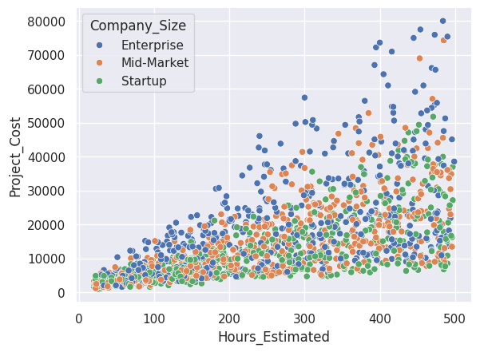
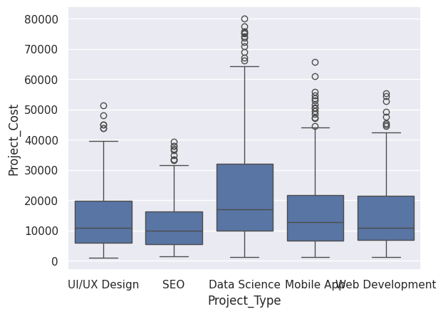
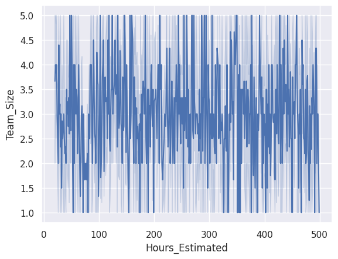
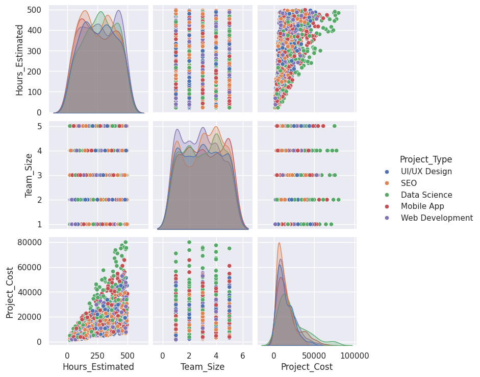

# 💎 PricePro AI: Software Project Cost Estimator

<p align="center">
  
</p>

PricePro AI is an end-to-end **Machine Learning regression project** that predicts the estimated cost of software projects based on project requirements such as project type, estimated hours, team size, company size, and required experience level.

The project includes data analysis, model training, hyperparameter tuning, model evaluation, and deployment using Streamlit.

---

## 🚀 Live Demo

**Try the live app here:**  
[👉 Launch PricePro AI](https://pricepro-ai-project-cost-predictor-6knflbliqk4okh2blbpt8v.streamlit.app/)

---

## 🎯 Problem Statement

Estimating the cost of software projects can be difficult because pricing depends on multiple factors such as project complexity, development hours, team size, company size, and required expertise.

This project aims to build a machine learning model that predicts software project cost in a more data-driven and consistent way.

---

## 📌 Project Workflow

1. Data Cleaning
2. Exploratory Data Analysis
3. Feature Engineering
4. Model Training
5. Hyperparameter Tuning using `GridSearchCV`
6. Model Evaluation
7. Model Deployment with Streamlit

---

## 📊 Exploratory Data Analysis

The EDA focused on understanding the relationship between project cost and key features such as estimated hours, project type, team size, and company size.

| Cost vs Hours | Cost Distribution by Project Type |
|---|---|
|  |  |

| Team Size Trend | Feature Relationships |
|---|---|
|  |  |

---

## 🧠 Model

The final model used in this project is a **Random Forest Regressor**.

The model was optimized using `GridSearchCV` to improve performance and select the best hyperparameters.

### Model Performance

| Metric | Value |
|---|---:|
| R² Score | 0.96 |
| Mean Absolute Error | $1,495 |

> Note: Since this is a regression problem, the model is evaluated using regression metrics such as R² Score and MAE, not classification accuracy.

---

## 🔑 Features Used

The model uses the following input features:

- Project Type
- Estimated Hours
- Team Size
- Company Size
- Required Experience Level

---

## 🛠️ Tech Stack

- Python
- Pandas
- NumPy
- Scikit-learn
- GridSearchCV
- Joblib
- Streamlit
- Matplotlib
- Seaborn

---

## 📦 How to Run Locally

Clone the repository:

```bash
git clone https://github.com/Ziad3Alaa3/PricePro-AI-Project-Cost-Predictor.git
cd PricePro-AI-Project-Cost-Predictor

Install dependencies:

pip install -r requirements.txt

Run the Streamlit app:

streamlit run app.py
📁 Project Structure
PricePro-AI-Project-Cost-Predictor/
│
├── app.py
├── Project_Cost_Predictor.ipynb
├── project_cost_model.pkl
├── requirements.txt
├── Cost_vs_Hours_by_CompanySize.png
├── Cost_Distribution_by_ProjectType.png
├── TeamSize_Trend_Over_Hours.png
├── Feature_Relationships_Matrix.png
└── README.md
👨‍💻 Developer

Ziad Alaa
Machine Learning Engineer

GitHub: Ziad3Alaa3
LinkedIn: (www.linkedin.com/in/ziadalaa-dev)
